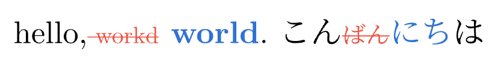
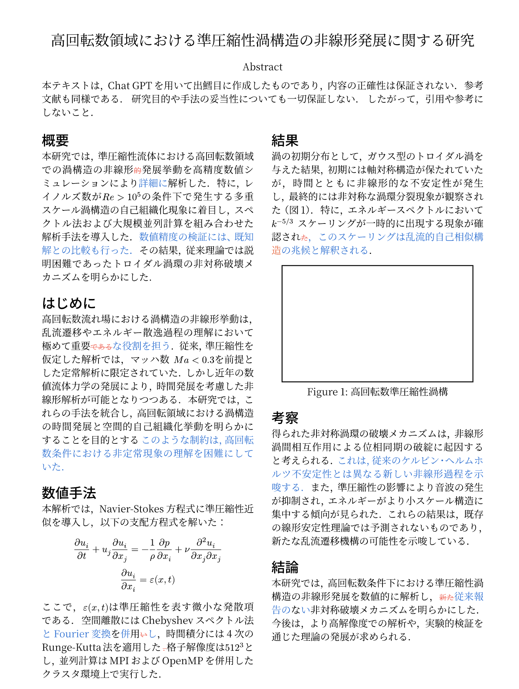

# diff-doc

This is a library for displaying document differences in Typst.

## Usage

### diff-string

Compares two strings and highlights the differences.

```typst
#import "@local/diff-doc:0.1.0": *

#let a = "hello, workd. こんばんは"
#let b = "hello, world. こんにちは"

#diff-string(a, b)
```

The output will look like this:



### diff-content

Compares two Typst contents and highlights the differences, preserving styles.

```typst
#import "@local/diff-doc:0.1.0": *

#diff-content(
  include "diff-a.typ",
  include "diff-b.typ"
)
```



## Functions

### `diff-string(a, b, format-plus, format-minus)`

- `a`, `b`: The two strings to compare.
- `format-plus`: A function to format added text. Defaults to bold blue text.
- `format-minus`: A function to format removed text. Defaults to struck-through red text.

### `diff-content(a, b, format-plus, format-minus)`

- `a`, `b`: The two Typst contents to compare.
- `format-plus`: A function to format added text. Defaults to bold blue text.
- `format-minus`: A function to format removed text. Defaults to struck-through red text.

## License

This project is licensed under the MIT License.
