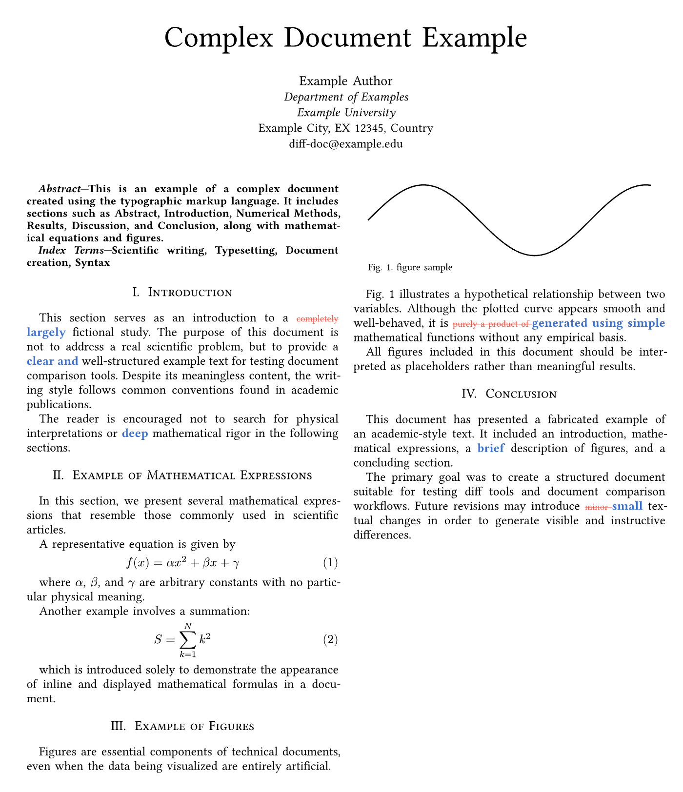

# palimset

This is a library for displaying document differences in Typst.
“Palimset” is a coined word combining the terms ‘palimpsest’ and ‘set’.

## Usage

### diff-string

Compares two strings and highlights the differences.

```typst
#import "@local/palimset:0.1.0": *

#let a = "hello, workd. こんばんは"
#let b = "hello, world. こんにちは"

#diff-string(a, b)
```

The output will look like this:


### diff-content

Compares two Typst contents and highlights the differences, preserving styles.

```typst
#import "@local/palimset:0.1.0": *

#diff-content(
  include "diff-a.typ",
  include "diff-b.typ"
)
```



### diff raw (block)

Write old and new text in a fenced code block. The separator line is literal.

````typst
#import "@preview/palimset:0.2.0": diff-show
#show: diff-show

```diff
hello, workd. こんばんは
---
hello, world. こんにちは
```
````

### diff raw (inline)

Use a fenced inline code block with the `diff` language tag.

````typst
```diff workd---world```
````

### Custom separator

````typst
#show: diff-show.with(
  block-separator: "\n:::\n",
  inline-separator: ":::",
)

```diff
hello, workd. range: 10---20
:::
hello, world. range: 10 to 20
```

Inline: ```diff workd---world:::world```
````

You can also pass `separator: ">>>"` to use the same delimiter for both block and inline.

## Functions

### `diff-string(a, b, format-plus, format-minus, split-regex)`

- `a`, `b`: The two strings to compare.
- `format-plus`: A function to format added text. (Default: `x => text(x, fill: blue, weight: "bold")`)
- `format-minus`: A function to format removed text. (Default: `x => strike(text(x, fill: red, size: 0.75em))`)
- `split-regex`: A regular expression string to split the strings for comparison. (Default: `"[^A-Za-z0-9]"`)

### `diff-content(a, b, format-plus, format-minus, split-regex)`

- `a`, `b`: The two Typst contents to compare.
- `format-plus`, `format-minus`, `split-regex`: Same as `diff-string`.

### `diff-from-text(text, separator, format-plus, format-minus, split-regex)`

Renders a diff from raw text that contains a separator between old and new versions.

- `separator`: Defaults to `"\n---\n"`.

### `diff-show(body, separator, block-separator, inline-separator, ...)`

Show rule wrapper for `raw` elements with language `diff`.

- `block-separator`: Separator for fenced blocks. Default: `"\n---\n"`.
- `inline-separator`: Separator for inline raw. Default: `"---"`.
- `separator`: When set, overrides both block and inline separators.

## License

This project is licensed under the MIT License.
